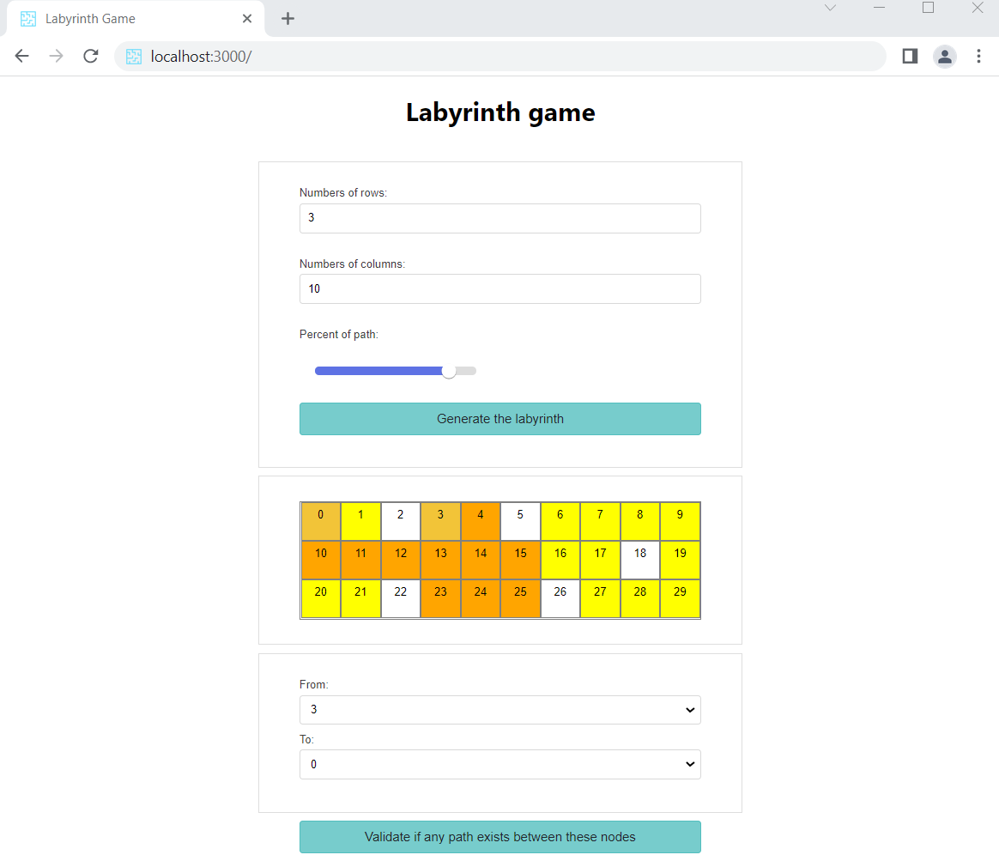

# Labyrinth App - React (ui) and Spring Boot (server side)

This project was bootstrapped with [Create React App](https://github.com/facebook/create-react-app).

## How to run the UI

### `npm start`

Runs the app in the development mode.\
Open [http://localhost:3000](http://localhost:3000) to view it in your browser.

## What is doing the project

1. Generate a matrix based on this input:
    - number of rows
    - number of columns
    - percentage of path <font color="yellow">&#9724;</font>
2. Generate a path <font color="orange">&#9724;</font> based on:
    - a starting point <font color="#F2C438">&#9724;</font>
    - an ending point <font color="#F2C438">&#9724;</font>



If no path is found the next message is displayed: <div style="background-color:red; color: white; width:200px; text-align: center"><font style=""> Path not found (404) </font></div>

## Technical considerations

There are used these react external libraries: 

    - "react-hook-form": "^7.27.0",
    - "react-input-slider": "^6.0.1",
    - "styled-components": "^5.3.3"

The server is called with this Api: http://localhost:8080/api/getpath and an input like this:

```json
{
    "from": { "x": 0,"y": 0 },
    "to": { "x": 2,"y": 1 },
    "matrix": [ [true, true, true],[true, true, true], [false, false, true]]
}
```
